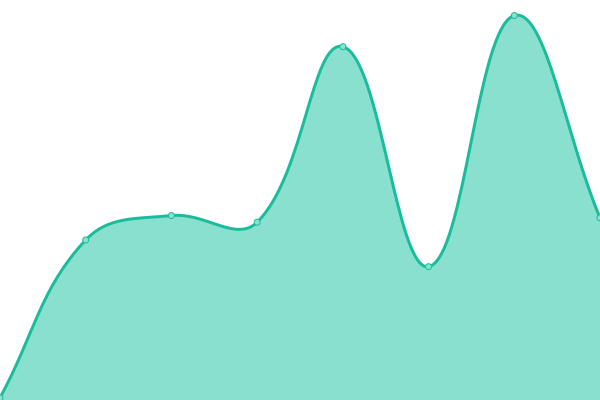
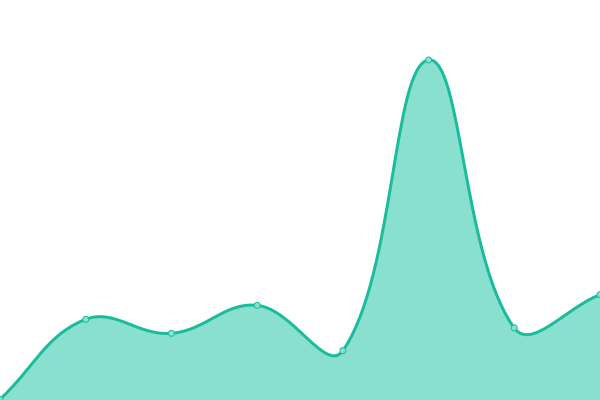
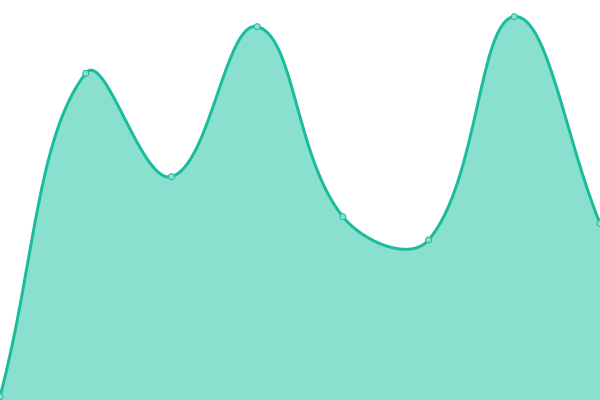

# [📈 Live Status](https://status.pan.dev): <!--live status--> **🟩 All systems operational**

This repository contains the open-source uptime monitor and status page for [Palo Alto Networks](https://www.paloaltonetworks.com), powered by [Upptime](https://github.com/upptime/upptime).

With [Upptime](https://upptime.js.org), you can get your own unlimited and free uptime monitor and status page, powered entirely by a GitHub repository. We use [Issues](https://github.com/PaloAltoNetworks/status.pan.dev/issues) as incident reports, [Actions](https://github.com/PaloAltoNetworks/status.pan.dev/actions) as uptime monitors, and [Pages](https://status.pan.dev) for the status page.

<!--start: status pages-->
<!-- This summary is generated by Upptime (https://github.com/upptime/upptime) -->
<!-- Do not edit this manually, your changes will be overwritten -->
<!-- prettier-ignore -->
| URL | Status | History | Response Time | Uptime |
| --- | ------ | ------- | ------------- | ------ |
|  [pan.dev](https://pan.dev) | 🟩 Up | [pan-dev.yml](https://github.com/PaloAltoNetworks/status.pan.dev/commits/HEAD/history/pan-dev.yml) | 

 153ms
     
 | 

<a href="https://status.pan.dev/history/pan-dev">100.00%</a>
    

|  [xsoar.pan.dev](https://xsoar.pan.dev) | 🟩 Up | [xsoar-pan-dev.yml](https://github.com/PaloAltoNetworks/status.pan.dev/commits/HEAD/history/xsoar-pan-dev.yml) | 

 120ms
     
 | 

<a href="https://status.pan.dev/history/xsoar-pan-dev">100.00%</a>
    

|  [prisma.pan.dev](https://prisma.pan.dev) | 🟩 Up | [prisma-pan-dev.yml](https://github.com/PaloAltoNetworks/status.pan.dev/commits/HEAD/history/prisma-pan-dev.yml) | 

 145ms
     
 | 

<a href="https://status.pan.dev/history/prisma-pan-dev">100.00%</a>
    

|  [panos.pan.dev](https://panos.pan.dev) | 🟩 Up | [panos-pan-dev.yml](https://github.com/PaloAltoNetworks/status.pan.dev/commits/HEAD/history/panos-pan-dev.yml) | 

 131ms
     
 | 

<a href="https://status.pan.dev/history/panos-pan-dev">100.00%</a>
    

|  [gallery.pan.dev](https://gallery.pan.dev) | 🟩 Up | [gallery-pan-dev.yml](https://github.com/PaloAltoNetworks/status.pan.dev/commits/HEAD/history/gallery-pan-dev.yml) | 

 122ms
     
 | 

<a href="https://status.pan.dev/history/gallery-pan-dev">100.00%</a>
    

<!--end: status pages-->

[**Visit our status website →**](https://status.pan.dev)

## 📄 License

- Powered by: [Upptime](https://github.com/upptime/upptime)
- Code: [MIT](./LICENSE) © [Palo Alto Networks](https://www.paloaltonetworks.com)
- Data in the `./history` directory: [Open Database License](https://opendatacommons.org/licenses/odbl/1-0/)
